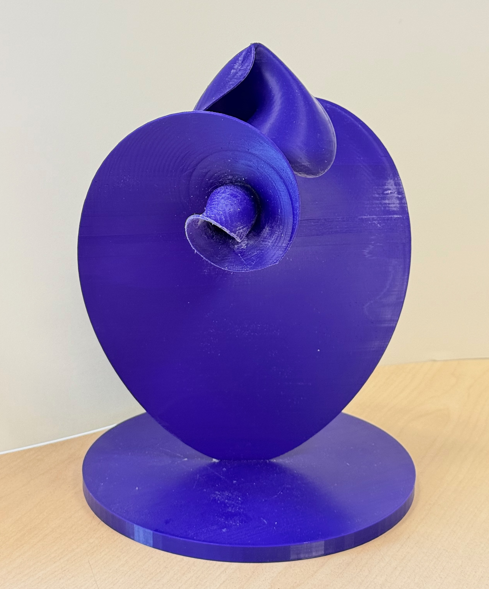

# 3D Printing of Invariant Manifolds in Dynamical Systems



## Overview

This repository contains resources for creating tangible visualizations of invariant manifolds in ordinary differential equations. Our approach combines advanced computational techniques with modern 3D printing processes to transform mathematical abstractions into physical models, providing new perspectives on complex dynamical systems.

## Purpose

Given the highly nonlinear nature of specific dynamical systems, we employ a diverse array of computational tools and software packages to:

1. Generate accurate numerical approximations of invariant manifolds
2. Create 3D renderings suitable for physical printing
3. Perform the necessary structural thickening and reinforcement
4. Produce tangible models that preserve mathematical properties

## Key Features

- Enable physical inspection of abstract mathematical objects, potentially revealing insights that are difficult to discern from purely digital representations
- Implement accurate computational visualization techniques with broad applicability
- Develop novel methods for structural reinforcement of delicate mathematical surfaces
- Integrate multiple computational frameworks for enhanced accuracy and reliability

## Technical Stack

### Primary Software
- **Wolfram Mathematica®** for core computations and manifold generation
- **MATLAB** for specialized numerical analysis and mesh processing

### Supporting Tools
- **CAD Software**
  - Blender for mesh manipulation and preparation
  - MeshLab for mesh analysis and repair
- **3D Printing Software**
  - Cura for slicing and print preparation
- **Custom numerical algorithms** for manifold computation and structural optimization

## Repository Contents

- Wolfram Mathematica® implementations of Algorithms 1 and 2
- Example scripts for the Lorenz, Arneodo-Coullet-Tresser, and Langford systems
- Utility functions for mesh/surface generation and file export
- Documentation and usage examples
- Sample parameter files and test cases

## Examples

Our work addresses the challenges of translating complex manifolds into printable meshes, showcasing results for:
- The Lorenz attractor
- Arneodo-Coullet-Tresser equations 
- Langford system

These examples demonstrate the physical realization of intersecting global manifolds, showing stable manifolds of equilibrium solutions intersecting unstable manifolds of other equilibrium solutions, revealing complex geometric organizations and their intersections.

## Getting Started

Please refer to the documentation directory for detailed usage instructions and examples.

## Citing This Work

If you use this software or methodology in your research, please cite our paper:

```
3D Printing of Invariant Manifolds in Dynamical Systems. [Authors], 2025.
```

## Contributing

Users are encouraged to submit issues, feature requests, and contribute improvements through pull requests. For detailed usage instructions and documentation, please refer to the repository's README file and accompanying documentation. The code is released under the MIT License to promote open scientific collaboration and reproducibility.

## Contact

For questions, bug reports, or collaboration inquiries, please use the GitHub issue tracker or contact the authors directly.

## License

This project is licensed under the MIT License - see the LICENSE file for details.

---

Last updated: March 2025
